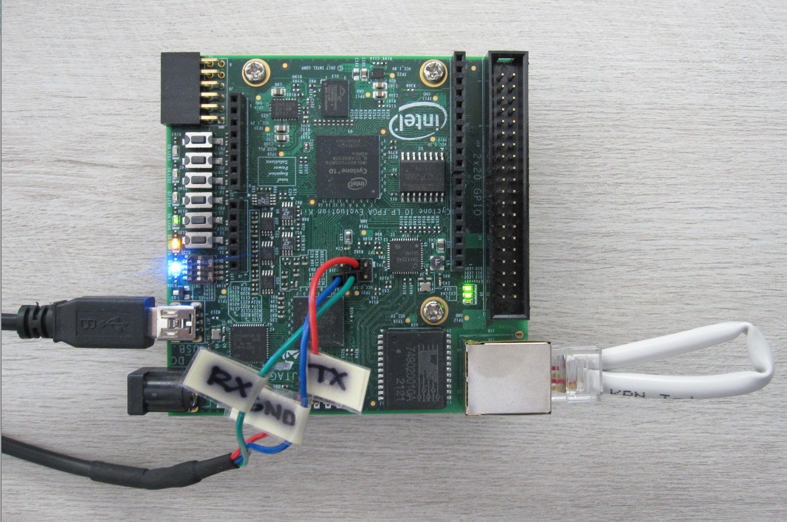
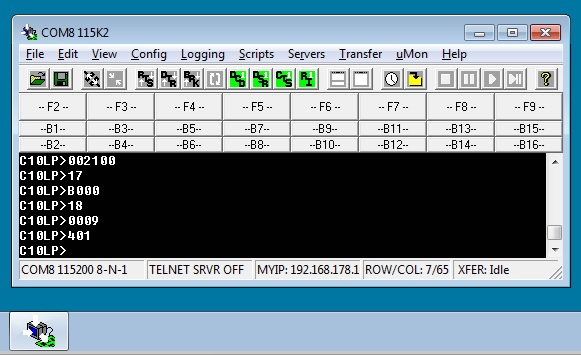
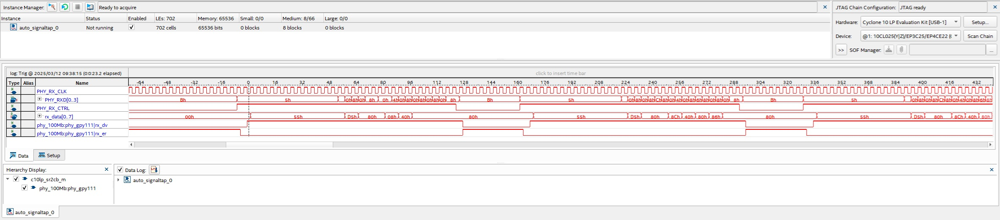

# C10LP

SR2CB (master) protocol HW setup for Intel&reg; Cyclone&reg; 10 LP Evaluation Kit with 100Mb (fast ethernet) RJ-45 loopback plug - connect pin 1 (TX+) to 3 (RX+) and pin 2 (TX-) to 6 (RX-).

Intel&reg; Cyclone&reg; 10 LP Evaluation Kit has a 1Gb/s Ethernet PHY (MaxLinear GPY111-PEF7071) and should be setup for 100Mb/s with a two-wired RJ-45 loopback plug via a terminal connection. The SR2CB FPGA logic provides an UART/TTL terminal connection via three pins (RX/TX/GND) of the C10LP J18 haeder. The terminal command "002100" (write 0x2100 to PHY register 0x00 STD_CTRL) forces the PHY to 100Mb full duplex - 100Mb and linkup LEDs should light. Read PHY registers 0x17 (PCY_MIICTRL - RXCLK is active also when link is down, copper data flow, RGMII mode) and 0x18 (PHY_MIISTAT - full duplex, 100Mbit/s) to verify set configuration.

The terminal command "401" sets the PHY link up bit in the SR2CB FPGA logic and the SR2CB master starts sending SR2CB frames.

