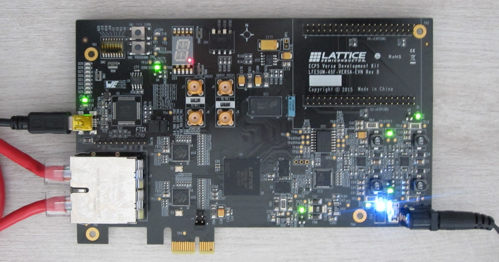
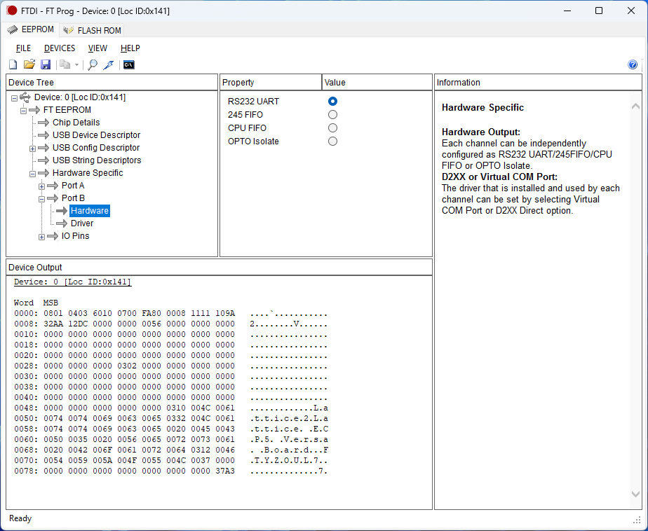
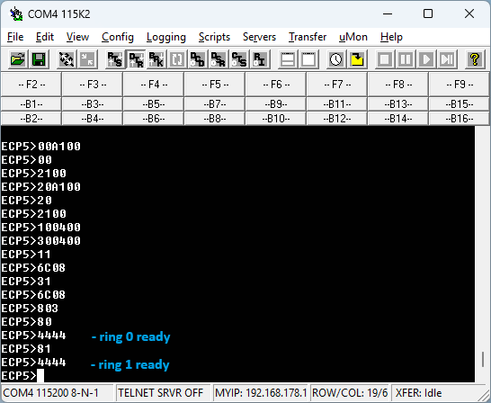

# ECP5

SR2CB protocol HW setup for Lattice Semiconductor&reg; ECP5&#8482; Development Board with cross-wired RJ-45 cable.

The Lattice Semiconductor&reg; ECP5&#8482; Development Board has a 1Gb/s Ethernet PHY (Marvell 88E1512) and should be setup for 100Mb/s with a cross-wired RJ-45 cable via a terminal connection. The SR2CB FPGA logic provides an UART/TTL terminal connection via the ECP5&#8482; Development Board FDTI USB port. The ECP5&#8482; Versa Development Board has from factory its FDTI FT2232H EEPROM not correctly configured for UART use. Reconfigure EEPROM by FT_PROG utility from FDTI - "Scan and parse". Set "Hardware Specific" - port B to UART and VCP (Virtual COM Port) and reprogram FT2232H EEPROM.

The terminal command "00A100" (write 0xA100 to PHY1 and PHY2 register 0 - Copper Control) forces the PHYs to 100Mb full duplex. Read PHYs registers 17 (Copper Specific Status Register 1 - 100Mbps, full duplex, auto-negotiation resolved and (copper) link-up). The terminal command "801" sets the PHYs link up bits in the SR2CB FPGA logic and the SR2CB master starts sending SR2CB frames.

